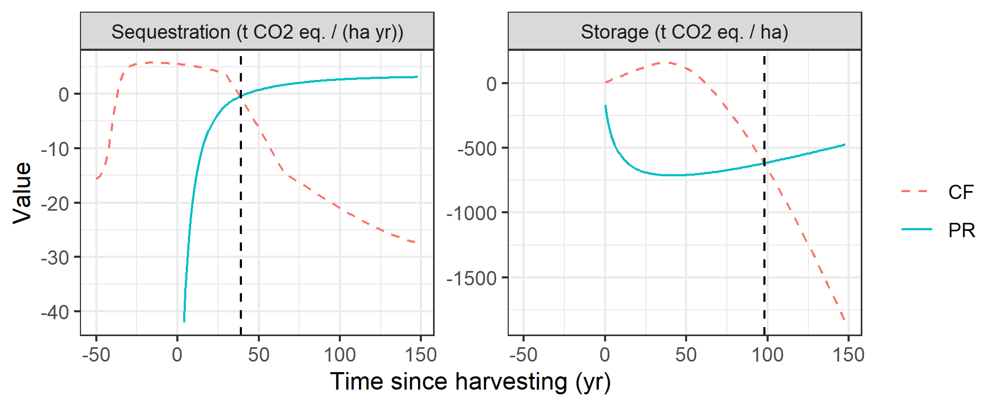
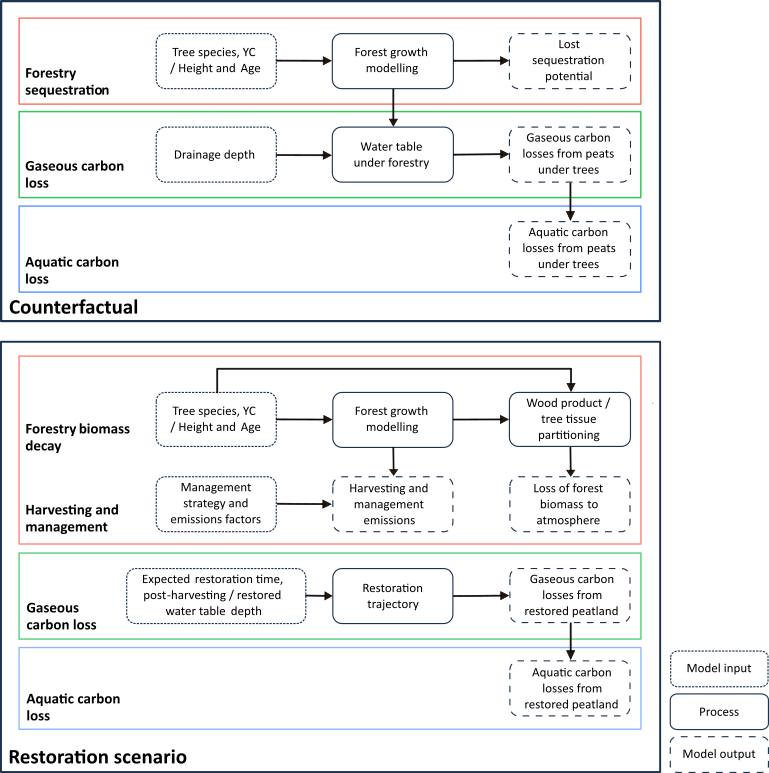
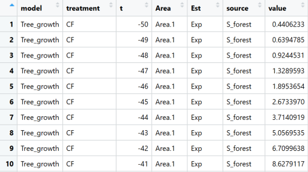

# PEATREST: A lifecycle assessment (LCA) model of carbon fluxes for restored afforested peatlands

## Jacob O'Sullivan 2026

### Description of the model

The life cycle assessment (LCA) PEATREST is a tool for assessing the carbon fluxes associated with restoring peatland previously drained for forestry. The LCA quantifies the carbon fluxes due to restoration interventions and ecosystem recovery compared against a ‘counterfactual’ of forestry retention. The model predicts two summary statistics: the carbon payback time and the carbon flux intercept. These represent the time following harvesting at which the peatland is predicted to first store or sequester more carbon than if the forestry had been retained. 

For the counterfactual, the model accounts for three key processes: carbon sequestration by the forest, gaseous emissions (CO2/CH4) from the drained peat under the forest stand and leaching of aquatic carbon (DOC and POC). The restoration scenario represents emissions associated with harvesting and management, carbon loss due to decay of forest biomass, gaseous emissions from the peatland and aquatic carbon losses. 

### User inputs

To run the model the user must input the following:
-	Area to be harvested/restored (ha)
-	Tree species (currently Sitka spruce and Scots pine are available)
-	Either a) Yield class or b) average tree height (m) and stand age (years)
-	Drainage depths at the site (m) at the time of tree removal
-	Water table depth under the trees (m)
-	Peat depth at the site (m)
-	Expected restoration time (years) following restoration
-	Restoration strategy including whether the forestry will be harvested and removed for processing or felled and left on site. 

### Key assumptions

- For tractability, forest growth is represented using a simplified model which is parameterised to reproduce the productivity of the forestry but ignores environmental fluctuations or long-term change. 
- Emissions rates from peats are predicted from water table depths only which are represented by annual averages; stochastic or intra-annual variation is ignored
- Additional drivers of emissions rates such as temperature, soil chemistry or litter input from the trees are not considered
- Aquatic carbon losses are represented using empirically estimated ratios to gaseous emissions
- The restoration of ecosystem function is represented using arbitrary functions chosen for their qualitative properties but not derived from first principles

### Model scheme

### Implementation

To run the PEATREST LCA, copy and modify the user input file Templates/PEATREST_input. Open the R script run/runPeatRest.R. Set the variable path to the location of the modified input file and run the script. This will implement the model and generate figures summarising the results. The main non-graphical output is a data frame with the following structure: 

The column 'model' partitions the data between the various sub-models 
- Tree_growth: 3PG output
- Forest_soils: Emissions from forest soils
- Forest_AqC_loss: Aquatic carbon loss from forest soils
- Management: Silvicultural and restoration emissions
- Peatland: Restoration of peatland ecosystem function (emissions/sequestration)
- Peatland_AqC_loss: Aquatic carbon loss from peatland

The 'treatment' column subsets the data into counterfactual (CF) and peatland restoration (PR) subsets.

Time since harvesting (years) is represented by column 't'.

The 'Area' column partitions the results by user input area. The input file allows users to model up to 5 different areas.

The 'Est' column takes a value of 'Exp', 'Min' or 'Max'. These are the expectation, minimum and maximum values generated by evaluating the model for the expected, minimum and maximum user inputs/parameter values.

The 'source' column indicates the type of emissions/sequestration. For example 'S_forest' corresponds to forestry sequestration, 'L_harv' to harvesting emissions etc. These are consistent with the algebraic notation in the PEATREST paper.

Finally, 'value' is the emission/sequestration in units t CO2 eq. 

